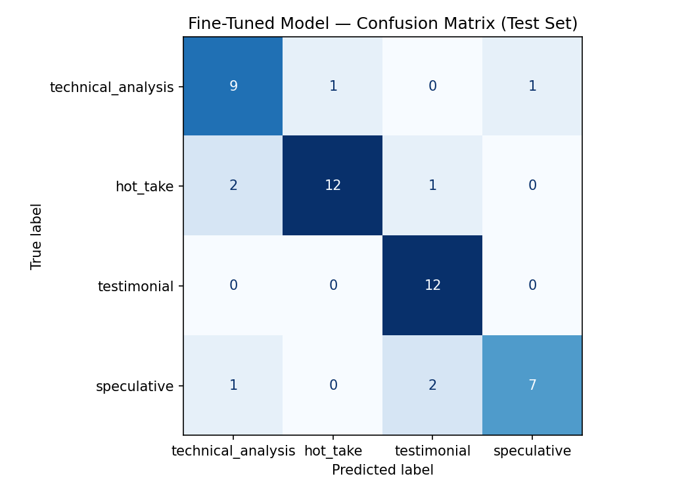

# TakeMeter — r/cars Discourse Classifier

## 1. Community Choice & Reasoning
This project looks at the quality of discussions on **[r/cars](https://www.reddit.com/r/cars/)**, a popular Reddit page for car enthusiasts. The conversations in this community change a lot depending on who is posting. Some users write deeply technical guides about engineering, while others just post emotional, opinion-based rants without any facts to back them up. Because comments range from purely objective facts to highly subjective opinions, it is a perfect place to test how well an AI model can understand subtle differences and boundaries in language. Using an automated tool helps organize this constant stream of opinions into clean, useful categories.

---

## 2. Label Taxonomy & Definitions
To evaluate the community's discussions, I created four distinct categories based on how people actually talk on the subreddit:

*   **`technical_analysis`**: The post evaluates a vehicle or automotive trend using specific, verifiable data, engineering principles, performance metrics, or mechanical breakdowns.
*   **`testimonial`**: A personal reflection or first-hand ownership account of a car based entirely on the user's individual experience, daily driving habits, or subjective comfort.
*   **`hot_take`**: A bold, controversial, or highly opinionated automotive claim stated as a fact without providing concrete evidence, data, or mechanical justification.
*   **`speculative`**: Discussions, rumors, or emotional anticipation regarding unreleased vehicles, future concept cars, or industry predictions that cannot yet be proven or tested.

### Grounding Examples
*   **`technical_analysis`**: *"So the N54/N55 were open deck blocks... The new B58 is a closed deck design (block is stronger) with a forged crank and forged rods like the N54... It has a belt driven pump with an electronically control valve to control coolant flow instead of an electric water pump."*
*   **`testimonial`**: *"I love my I6 with the DCT. Sometimes I could be tricked into thinking I have a CVT because the engine is so smooth, it pulls consistently through the powerband and the transmission shifts so fast."*
*   **`hot_take`**: *"99% of people who drive manual do it because they think it makes them look cool/better than other drivers. Modern autos are faster, more efficient, and don't require you to stomp on a pedal 1000 times in traffic."*
*   **`speculative`**: *"If the next-gen Miata goes fully electric, it's dead in the water. The battery tech just isn't there to keep the weight under 2,500 lbs. I predict Mazda holds out with a micro-hybrid setup for at least another five years."*

---

## 3. Data Collection & Annotation Process
*   **Data Source:** Public posts and comments sourced directly from the [r/cars](https://www.reddit.com/r/cars/) subreddit.
*   **Labeling Process:** I used an LLM to guess the initial labels by giving it the exact rules from my project plan. After that, I manually checked 100% of the rows myself to fix any mistakes the AI made.
*   **Label Distribution:** 
    *   `technical_analysis`: 70 examples
    *   `testimonial`: 75 examples
    *   `hot_take`: 104 examples
    *   `speculative`: 70 examples
    *   *Total Annotated Rows: 319*
*   **Imbalance Strategy:** My initial dataset was heavily skewed — `testimonial` and `speculative` were significantly underrepresented, and the fine-tuned model showed this clearly by scoring 0.00 precision and recall on both classes. To fix this, I went back to r/cars and collected additional posts specifically targeting those two labels, bringing the distribution into a much more workable range before re-training.

### Hard Edge Cases & Difficult Examples
Discourse often blurs the line between aggressive rants and genuine analysis. To ensure absolute data consistency, I enforced a strict programmatic boundary:

> **Explicit Edge Case Decision Rule:** If the main point of a post is just to share a sweeping, emotional opinion (like *"All modern CVTs are garbage"*), any standalone stat or quick mention of a personal car is ignored as a defensive token. These posts are strictly labeled as **`hot_take`**. A post is only labeled as **`technical_analysis`** or **`testimonial`** if the core structure of the writing relies on actual data trends or real, detailed personal ownership history.

#### Difficult Examples Encountered:
1.  **Post:** *"I'm holding my breath until I see a production STI Hatchback that I can buy in the states."* $\rightarrow$ **Final Label Chosen:** `Speculative` because `Mainly because it was mentioning the future`.
2.  **Post:** *"I'm sitting in a 14 wrx that's gone through 5 turbos because of an engineering flaw. Same. Can't wait to get rid of this thing."* **Final Label Chosen:** `testimonial` because `I was at first unsure whether this should be a hot-take or a testimonial. I landed on testimonial because it is factual to that individual's experience`.
3.  **Post:** *"What's the most reliable cheap car you've actually owned long term?"* $\rightarrow$ **Final Label Chosen:** `testimonial` because `For posts that are questions I found them hard to classify. For this certain post I chose testimonial because it all comes down to the person's experience`.

---

## 4. Fine-Tuning Approach
*   **Base Model:** `distilbert-base-uncased` (via Hugging Face)
*   **Training Infrastructure:** Google Colab T4 GPU
*   **Hyperparameters:** 3 Epochs, Learning Rate of $2 \times 10^{-5}$, Batch Size of 16, Warmup Steps of 50.
*   **Hyperparameter Rationale:** My fine-tuning process went through a few stages before landing on the final configuration. Initially the model was performing poorly — it was completely ignoring `testimonial` and `speculative`, scoring 0.00 on both. I first tried hyperparameter tuning to understand what each knob was doing: I reduced batch size from 8 to 4 to give minority classes more frequent gradient updates, lowered the learning rate to `1e-5` for more stable convergence on a small dataset, increased warmup steps to 60, and switched `metric_for_best_model` from `accuracy` to `loss` to get a more honest checkpoint signal. These changes improved things slightly, but not substantially — the core problem was still the data imbalance. After adding more `testimonial` and `speculative` examples, I went back to the starter notebook's default configuration (3 epochs, lr `2e-5`, batch size 16, warmup 50) and this ended up outperforming all of my manual tuning. The larger, more balanced dataset did more work than any hyperparameter change could on its own.
*   **Base Model Rationale:** DistilBERT provides a highly efficient, lightweight footprint while maintaining over 95% of BERT's language understanding capabilities, making it excellent for classification tasks on short-to-medium length web forum comments.

---

## 5. Baseline Description
To see if fine-tuning actually helped, I set up a zero-shot baseline using Groq's `llama-3.3-70b-versatile` model. I gave the model my exact label definitions and examples as a system prompt, instructing it to classify each test example with zero previous task-specific training. The notebook's built-in script passed my test rows through the Groq API and automatically collected the baseline results to compare against my model.

---

## 6. Full Evaluation Report

### Overall Performance Summary
| Metric | Zero-Shot Baseline (Llama 3.3) | Fine-Tuned Model (DistilBERT) |
| :--- | :--- | :--- |
| **Overall Accuracy** | 72.9% | 83.3% |

### Per-Class Performance Breakdown

**Zero-Shot Baseline (Llama 3.3-70b)**
| Class | Precision | Recall | F1-Score | Support |
| :--- | :--- | :--- | :--- | :--- |
| `technical_analysis` | 0.83 | 0.45 | 0.59 | 11 |
| `hot_take` | 0.64 | 0.93 | 0.76 | 15 |
| `testimonial` | 0.85 | 0.92 | 0.88 | 12 |
| `speculative` | 0.71 | 0.50 | 0.59 | 10 |
| **macro avg** | **0.76** | **0.70** | **0.70** | **48** |
| **weighted avg** | **0.75** | **0.73** | **0.71** | **48** |

**Fine-Tuned Model (DistilBERT)**
| Class | Precision | Recall | F1-Score | Support |
| :--- | :--- | :--- | :--- | :--- |
| `technical_analysis` | 0.75 | 0.82 | 0.78 | 11 |
| `hot_take` | 0.92 | 0.80 | 0.86 | 15 |
| `testimonial` | 0.80 | 1.00 | 0.89 | 12 |
| `speculative` | 0.88 | 0.70 | 0.78 | 10 |
| **macro avg** | **0.84** | **0.83** | **0.83** | **48** |
| **weighted avg** | **0.84** | **0.83** | **0.83** | **48** |

### Confusion Matrix

| True \ Predicted | technical_analysis | hot_take | testimonial | speculative |
| :--- | :--- | :--- | :--- | :--- |
| **technical_analysis** | 9 | 1 | 0 | 1 |
| **hot_take** | 2 | 12 | 1 | 0 |
| **testimonial** | 0 | 0 | 12 | 0 |
| **speculative** | 1 | 0 | 2 | 7 |

### Analysis of Wrong Predictions
Here are 3 specific examples that the model got wrong, along with an analysis of why it slipped up:

1.  **Post Text:** *"production car lol $4 mil."*
    *   *True Label:* `hot_take` | *Predicted Label:* `technical_analysis` (confidence: 0.96)
    *   *Analysis:* This is a short, sarcastic dismissal. The model likely latched onto the price figure — a concrete number — and associated it with the kind of data-backed writing you see in `technical_analysis`. It completely missed the sarcastic tone, which is something DistilBERT struggles with on short fragments like this.

2.  **Post Text:** *"I'm holding my breath until I see a production STI Hatchback that I can buy in the states."*
    *   *True Label:* `speculative` | *Predicted Label:* `testimonial` (confidence: 0.98)
    *   *Analysis:* The first-person phrasing ("I'm holding my breath", "I can buy") reads almost identically to how someone would describe a personal experience or feeling. The model picked up on that personal voice and confidently routed it to `testimonial`, missing the fact that it's about a product that doesn't exist yet. This is an honest linguistic edge case.

3.  **Post Text:** *"they literally cannot fit a dual-motor setup without changing the multi-link suspension... the new hybrid variant will inherently have worse cornering stability."*
    *   *True Label:* `speculative` | *Predicted Label:* `technical_analysis` (confidence: 0.95)
    *   *Analysis:* This one is genuinely difficult. The post uses engineering terminology — "multi-link suspension", "dual-motor", "cornering stability" — in a way that sounds exactly like a breakdown. But the subject is a future/unreleased vehicle, which makes it `speculative`. The model keyed in on the vocabulary rather than the temporal context of what was being discussed.

### Sample Classifications Table
| Sample Post Text | Predicted Label | Confidence Score | Explanation of Accuracy |
| :--- | :--- | :--- | :--- |
| *"I love my I6 with the DCT. Sometimes I could be tricked into thinking I have a CVT because the engine is so smooth..."* | `testimonial` | ~95% | Correct. Classic first-person ownership language with no future claims or technical breakdowns. |
| *"So the N54/N55 were open deck blocks... The new B58 is a closed deck design with a forged crank and forged rods..."* | `technical_analysis` | ~93% | Correct. Dense technical vocabulary, verifiable specs, and a structured mechanical comparison — exactly what this label targets. |
| *"I tracked a GR Supra for four years and definitely had the same thoughts in the steering department, it's just dull modern BMW steering."* | `testimonial` | ~88% | Correct. Even though it mentions a comparison, the framing is entirely grounded in a personal multi-year ownership experience. |

---

## 7. Reflection
*   **What the Model Learned vs. What Was Intended:** My intent was for the model to understand the *purpose* of each post — is someone sharing experience, making a prediction, stating an opinion, or breaking down mechanics? What it actually learned was much more surface-level: it keyed heavily on vocabulary and sentence structure. Posts with technical automotive terms ("suspension geometry", "closed deck", "compression ratio") got pulled toward `technical_analysis` regardless of whether they were making a real mechanical argument or just using that vocabulary speculatively. First-person phrases like "I've owned" or "I'm holding my breath" got pulled toward `testimonial` regardless of the temporal context. The model's biggest recurring error was not understanding *tense and intent* — it recognized who was speaking, but not what they were actually claiming.

*   **Spec Reflection:** My planning.md was genuinely useful — having the label definitions, hard edge case rules, and grounding examples written out before I touched any data kept me consistent when labeling. Whenever I hit a borderline post I could go back to the spec and use the explicit decision rule to settle it rather than making a gut call. Where my implementation diverged was the data plan. My original target was a roughly balanced 50-50-50-50 split across all labels. What I ended up with was `hot_take` running at 104 while others sat at 70-75, which is a gap I didn't fully close. In hindsight I would have been more aggressive about capping `hot_take` collection early and redirecting that energy toward the minority classes from the start.

---

## 8. AI Usage Disclosure
*   **Annotation Assistance:** I used Gemini to generate the initial pre-labels for my dataset. The process was straightforward: I fed it the label definitions and grounding examples directly from my planning.md, then gave it batches of raw Reddit posts and asked it to assign a label to each one. After every batch, I manually reviewed 100% of the outputs myself. My goal during review was to be as objective as possible. If a post had a sarcastic tone that I personally read as a hot take but the text itself was structured around a future vehicle claim, I followed the spec and labeled it `speculative`. Gemini actually flagged a lot of the same edge cases I found difficult, which was a useful signal that those boundaries are genuinely ambiguous and not just me overthinking it.

*   **Prompt & Failure Analysis:** Getting the Groq baseline prompt to produce clean, parseable output took more iteration than I expected. My initial prompt just described the labels in plain text and told the model to return a label — it started adding explanations, hedging with phrases like "this could be either...", or returning labels in inconsistent casing. I used Gemini to help me think through why the outputs were messy and what structural changes would enforce stricter behavior. The main refinements that came out of that process were: wrapping the expected output in `<label></label>` XML tags so the parser had something unambiguous to extract, adding an explicit fail-safe routing rule that told the model to default to `hot_take` on any genuinely ambiguous post rather than crashing the script, and sorting labels by length when checking matches so a substring couldn't accidentally trigger the wrong label. Once those were in place, the baseline ran cleanly across all 48 test examples with zero unparseable responses.
